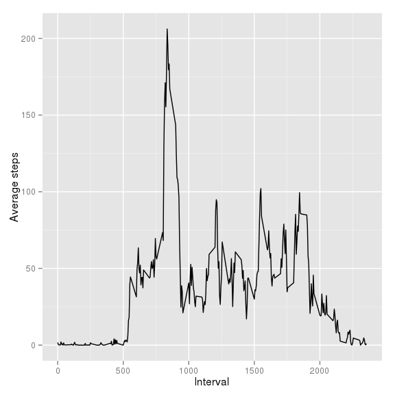
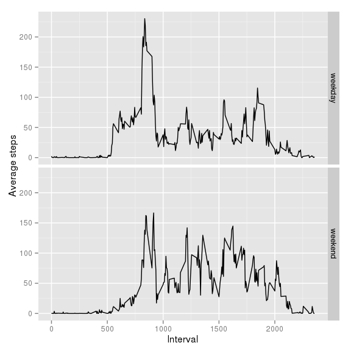

# Reproducible Research: Peer Assessment 1


## Loading and preprocessing the data
First, i loaded the data from activity.csv file into R.

```r
dataset <- read.csv(file="/home/kasia/RepData_PeerAssessment1/activity.csv", header=TRUE, sep=",")
```
In order to process or transform the data into a format suitable for my analysis, i took a quick look
at the data and its structure.

```r
head(dataset)
```

```
##   steps       date interval
## 1    NA 2012-10-01        0
## 2    NA 2012-10-01        5
## 3    NA 2012-10-01       10
## 4    NA 2012-10-01       15
## 5    NA 2012-10-01       20
## 6    NA 2012-10-01       25
```

```r
str(dataset)
```

```
## 'data.frame':	17568 obs. of  3 variables:
##  $ steps   : int  NA NA NA NA NA NA NA NA NA NA ...
##  $ date    : Factor w/ 61 levels "2012-10-01","2012-10-02",..: 1 1 1 1 1 1 1 1 1 1 ...
##  $ interval: int  0 5 10 15 20 25 30 35 40 45 ...
```
I transformed 'date' column from factor type into date type.

```r
dataset$date <- as.Date(dataset$date, format = "%Y-%m-%d")
```

## What is mean total number of steps taken per day?
Since for this part of the assignment missing values in the dataset can be ignored, i extracted a subset containing only complete cases.

```r
complete_cases_only <- dataset[complete.cases(dataset),]
```
In order to prepare a histogram of the total number of steps taken each day, i used dplyr package to prepare the dataset. 

```r
library(dplyr)
```

```
## 
## Attaching package: 'dplyr'
## 
## The following object is masked from 'package:stats':
## 
##     filter
## 
## The following objects are masked from 'package:base':
## 
##     intersect, setdiff, setequal, union
```

```r
total_steps_per_day_1 <- summarise( group_by(complete_cases_only, date), total_steps = sum(steps))

hist(total_steps_per_day_1$total_steps
      , xlab = "Total steps per day"
      , ylab = "Entries"
      , main = NULL
      , breaks = 10
      )
```

 

I calculated the mean and median of total number of steps taken per day.

```r
mean(total_steps_per_day_1$total_steps )
```

```
## [1] 10766.19
```

```r
median(total_steps_per_day_1$total_steps )
```

```
## [1] 10765
```

## What is the average daily activity pattern?
To make a time series plot of the 5-minute interval and the average number of steps taken, averaged across all days, i prepared a dataset using dplyr package...

```r
avg_steps_per_interval <- summarise( group_by(dataset, interval), avg_steps = mean(steps, na.rm = TRUE))
```
... and used ggplot package to create a plot.

```r
library(ggplot2)

ggplot(avg_steps_per_interval,
        aes(x=interval,
            y=avg_steps)
  ) +
  geom_line() +  
  xlab("Interval") +
  ylab("Average steps")
```

 

I checked which 5-minute interval, on average across all the days in the dataset, contains the maximum number of steps.

```r
avg_steps_per_interval[which.max(avg_steps_per_interval$avg_steps),]
```

```
## Source: local data frame [1 x 2]
## 
##   interval avg_steps
## 1      835  206.1698
```

## Imputing missing values
I calculated the total number of missing values in the dataset.

```r
nrow(dataset[!complete.cases(dataset),])
```

```
## [1] 2304
```
In order to fill in all of the missing values in the dataset, i used the mean for that 5-minute interval, calculated in the previous step. 

I created a new dataset that is equal to the original dataset but with the missing data filled in.

```r
missing_values_filled <- dataset
for (i in 0:max(missing_values_filled$interval)){
    missing_values_filled[(!complete.cases(missing_values_filled) & missing_values_filled$interval == i) , 1 ]  <-  avg_steps_per_interval[avg_steps_per_interval$interval == i, 2]
}
```

For the dataset with missing values filled in, i made a histogram of the total number of steps taken each day.

```r
total_steps_per_day_2 <- summarise( group_by(missing_values_filled, date), total_steps = sum(steps))

hist(total_steps_per_day_2$total_steps
     , xlab = "Total steps per day"
     , ylab = "Entries"
     , main = NULL
     , breaks = 10
     )
```

 


The median total number of steps taken per day differ from the estimate from the first part of the assignment.  

```r
median(total_steps_per_day_2$total_steps )
```

```
## [1] 10766.19
```
The mean value does not differ from the estimate.

```r
mean(total_steps_per_day_2$total_steps )
```

```
## [1] 10766.19
```

In this dataset, mean and median values of total number of steps taken per day are equal (which was not the case in the dataset with missing values ignored).

## Are there differences in activity patterns between weekdays and weekends?
I created a new factor variable in the dataset with two levels – “weekday” and “weekend” indicating whether a given date is a weekday or weekend day.

```r
missing_values_filled$day_of_week <- weekdays(missing_values_filled$date) 
missing_values_filled$day_type[ missing_values_filled$day_of_week == "sobota"] <- "weekend"
missing_values_filled$day_type[ missing_values_filled$day_of_week == "niedziela"] <- "weekend"
missing_values_filled$day_type[ ( missing_values_filled$day_of_week != "niedziela" & missing_values_filled$day_of_week != "sobota") ] <- "weekday"
missing_values_filled$day_type <- factor(missing_values_filled$day_type)
```

Finally i made a panel plot containing a time series plot of the 5-minute interval and the average number of steps taken, averaged across all weekday days or weekend days.

```r
avg_steps_per_interval_by_day_type <- summarise( group_by(missing_values_filled, interval, day_type), avg_steps = mean(steps))

library(ggplot2)

ggplot(avg_steps_per_interval_by_day_type,
       aes(x=interval,
           y=avg_steps)
  ) +
  geom_line() +  
  xlab("Interval") +
  ylab("Average steps") +
  facet_grid(day_type ~ .)
```

 

